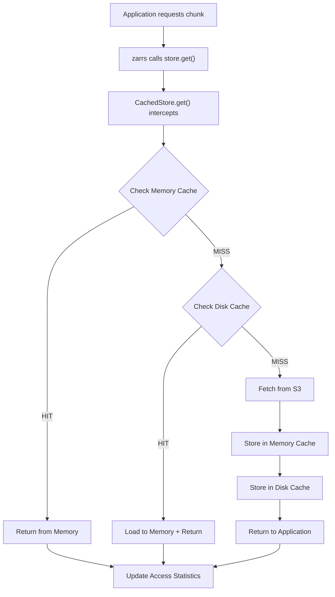
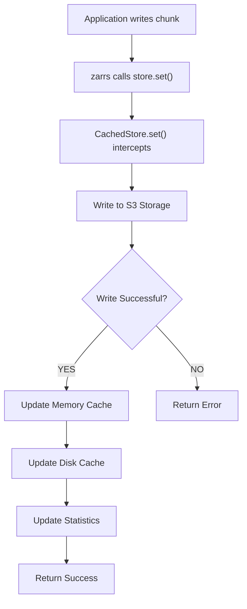

# Zarrs-Cache Dataflow Architecture

This document explains how zarrs-cache intercepts and enhances the standard zarrs-S3 connection flow, providing intelligent caching for improved performance.

## Overview

The zarrs-cache library acts as a transparent caching layer between zarrs applications and S3 storage, intercepting read/write operations to provide high-performance local caching without requiring changes to existing zarrs code.

## Standard zarrs-S3 Flow (Without Caching)

```
┌─────────────────┐    ┌─────────────────┐    ┌─────────────────┐
│   Application   │───▶│      zarrs      │───▶│   S3 Storage    │
│                 │    │    Library      │    │                 │
│ - Read chunks   │    │ - Decode/Encode │    │ - Object store  │
│ - Write arrays  │    │ - Metadata      │    │ - Network I/O   │
│ - Query data    │◀───│                 │◀───│ - High latency  │
└─────────────────┘    └─────────────────┘    └─────────────────┘
```

**Limitations:**
- Every read operation requires network round-trip to S3
- High latency for repeated access to same chunks
- Network bandwidth consumption for duplicate requests
- No local persistence of frequently accessed data

## Enhanced Flow with zarrs-cache

```
┌─────────────────┐    ┌─────────────────┐    ┌─────────────────┐    ┌─────────────────┐
│   Application   │───▶│      zarrs      │───▶│  zarrs-cache    │───▶│   S3 Storage    │
│                 │    │    Library      │    │   (CachedStore) │    │                 │
│ - Read chunks   │    │ - Decode/Encode │    │                 │    │ - Object store  │
│ - Write arrays  │    │ - Metadata      │    │ ┌─────────────┐ │    │ - Network I/O   │
│ - Query data    │◀───│                 │◀───│ │ CACHE LAYER │ │    │ - Reduced load  │
└─────────────────┘    └─────────────────┘    │ │             │ │    └─────────────────┘
                                              │ │  Memory     │ │             ▲
                                              │ │    +        │ │             │
                                              │ │   Disk      │ │             │
                                              │ │    +        │ │             │
                                              │ │ Analytics   │ │             │
                                              │ └─────────────┘ │             │
                                              └─────────────────┘             │
                                                       │                      │
                                                       └──────────────────────┘
                                                        Cache Miss: Fetch from S3
```

## Detailed Interception Points

### 1. Storage Interface Interception

The zarrs-cache library implements the zarrs storage traits, acting as a proxy:

```rust
// Standard zarrs usage
let store = S3Store::new(bucket, region)?;
let array = zarrs::Array::open(&store, "/path/to/array")?;

// With zarrs-cache (transparent replacement)
let s3_store = S3Store::new(bucket, region)?;
let cached_store = CachedStore::new(s3_store, cache_config)?;
let array = zarrs::Array::open(&cached_store, "/path/to/array")?;
```

### 2. Method Interception Points

zarrs-cache intercepts these key storage operations:

- **`get()`** - Reading chunks/metadata
- **`set()`** - Writing chunks/metadata  
- **`exists()`** - Checking object existence
- **`list()`** - Directory/prefix listing
- **`delete()`** - Object deletion

## Cache Storage Strategy

### Memory Cache (L1 - Fastest)
```
┌─────────────────────────────────────────────────────────────┐
│                    Memory Cache (LRU)                       │
├─────────────────────────────────────────────────────────────┤
│  Key: "/array/chunks/0.0.0"                                 │
│  Value: [chunk_data]                                        │
│  Metadata: {size: 1024, last_access: timestamp, hits: 5}    │
├─────────────────────────────────────────────────────────────┤
│  Key: "/array/.zarray"                                      │
│  Value: [json_metadata]                                     │
│  Metadata: {size: 256, last_access: timestamp, hits: 12}    │
└─────────────────────────────────────────────────────────────┘
```

### Disk Cache (L2 - Persistent)
```
Cache Directory Structure:
/tmp/zarrs_cache/
├── chunks/
│   ├── hash_of_key_1.cache    # Chunk data files
│   ├── hash_of_key_2.cache
│   └── ...
├── metadata/
│   ├── hash_of_key_1.meta     # Metadata files
│   └── hash_of_key_2.meta
└── index.db                   # Cache index and statistics
```

## Read Operation Flow



## Write Operation Flow



## Cache Key Strategy

### Chunk Data Keys
```
Format: "{array_path}/chunks/{chunk_coordinates}"
Examples:
- "/weather/temperature/chunks/0.0.0"
- "/weather/temperature/chunks/1.2.3" 
- "/satellite/imagery/chunks/10.5.2"
```

### Metadata Keys
```
Format: "{array_path}/{metadata_file}"
Examples:
- "/weather/temperature/.zarray"
- "/weather/temperature/.zattrs"
- "/weather/temperature/.zgroup"
```

## Intelligent Caching Decisions

### What Gets Cached
✅ **Cached (High Value)**
- Chunk data (array contents)
- Metadata files (.zarray, .zattrs)
- Frequently accessed objects
- Small to medium-sized objects

❌ **Not Cached (Low Value)**
- Very large objects (> configured threshold)
- Write-once, read-never objects
- Temporary/scratch data
- Objects with very short TTL

### Cache Eviction Strategy

1. **LRU (Least Recently Used)** - Primary eviction method
2. **Size-based** - Evict when cache size limits reached
3. **TTL-based** - Evict expired entries
4. **Access pattern analysis** - Evict objects with poor access patterns

## Performance Benefits

### Latency Reduction
```
Operation          | Without Cache | With Cache (Hit) | Improvement
-------------------|---------------|------------------|------------
Small chunk read   | 50-200ms      | 0.1-1ms          | 50-2000x
Metadata read      | 30-100ms      | 0.05-0.5ms       | 200-2000x
Repeated access    | 50-200ms      | 0.1-1ms          | 50-2000x
```

### Bandwidth Savings
```
Scenario                    | Cache Hit Rate | Bandwidth Saved
----------------------------|----------------|----------------
Scientific data analysis    | 80-95%         | 80-95%
Repeated visualization      | 90-99%         | 90-99%
Iterative processing        | 70-90%         | 70-90%
```

## Cache Analytics and Monitoring

### Real-time Metrics
```rust
let stats = cached_store.get_cache_stats();
println!("Cache hit rate: {:.2}%", stats.hit_rate() * 100.0);
println!("Memory usage: {} / {}", stats.memory_used, stats.memory_capacity);
println!("Disk usage: {} / {}", stats.disk_used, stats.disk_capacity);
```

### Performance Analytics
- Access pattern analysis
- Hot/cold data identification
- Cache efficiency recommendations
- Automatic cache warming suggestions

## Integration Examples

### Basic Integration
```rust
use zarrs_cache::{CachedStore, CacheConfig};

// Create S3 store
let s3_store = S3Store::new("my-bucket", "us-west-2")?;

// Wrap with cache
let cache_config = CacheConfig::default()
    .with_memory_size(100 * 1024 * 1024)  // 100MB
    .with_disk_cache("/tmp/zarrs_cache", 1024 * 1024 * 1024); // 1GB

let cached_store = CachedStore::new(s3_store, cache_config)?;

// Use normally with zarrs
let array = zarrs::Array::open(&cached_store, "/my/array")?;
```

### Advanced Configuration
```rust
use zarrs_cache::{HybridCache, HybridCacheConfig, MetricsCollector};

let cache_config = HybridCacheConfig {
    memory_size: 256 * 1024 * 1024,        // 256MB memory
    disk_size: Some(2 * 1024 * 1024 * 1024), // 2GB disk
    ttl: Some(Duration::from_secs(3600)),   // 1 hour TTL
    promotion_threshold: 0.5,               // Promote after 0.5 accesses/sec
    maintenance_interval: Duration::from_secs(60), // Cleanup every minute
    // ... more options
};

let cache = HybridCache::new(cache_config)?;
let cached_store = CachedStore::with_cache(s3_store, cache)?;
```

## Summary

zarrs-cache provides a transparent, high-performance caching layer that:

1. **Intercepts** all zarrs storage operations without code changes
2. **Caches** frequently accessed chunks and metadata in memory and disk
3. **Reduces** S3 API calls and network bandwidth by 70-99%
4. **Improves** read latency by 50-2000x for cached data
5. **Provides** detailed analytics and automatic optimization
6. **Maintains** full compatibility with existing zarrs applications

The caching layer is completely transparent to applications while providing significant performance improvements for data-intensive workloads.
